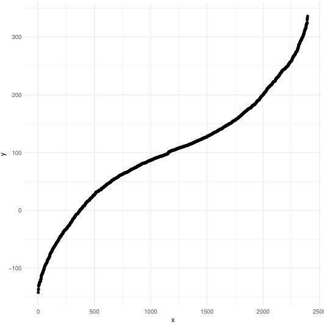
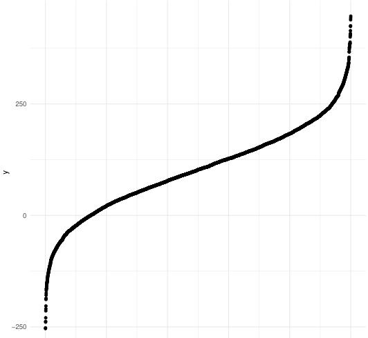
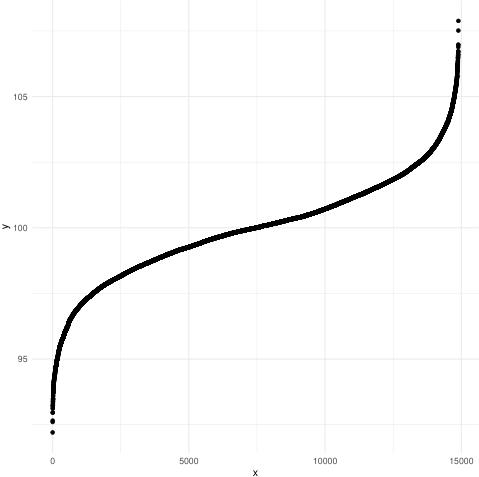
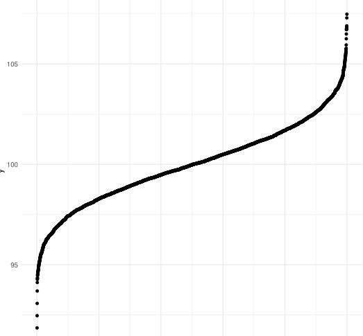
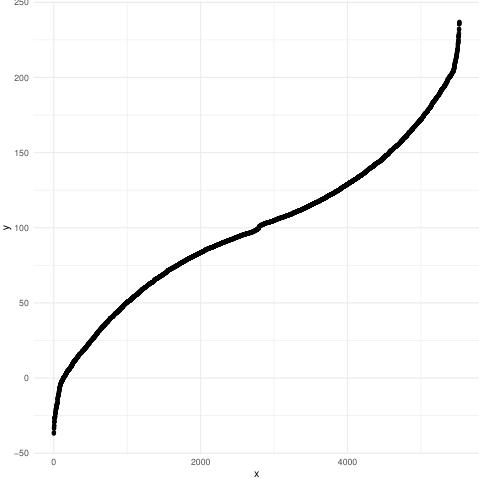
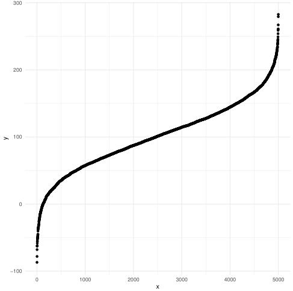
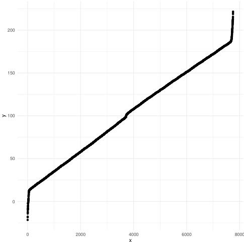
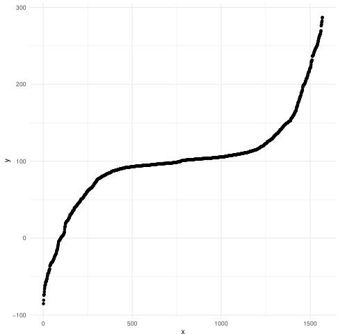
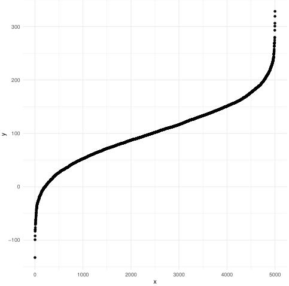

# normal_framework

Framework algorithm to generate a highly customizable normal distribution.

`norml_gen1` is for generating normal distribution whose standard deviation is higher or equal than 1.

`norml_gen2` is for generating normal distribution whose standard deviation is lower or equal than 1.

## Functions

`normal_gen1 <- function(
  n_inpt,
  mean_inpt,
  sd_inpt,
  offset_proba = 0.001,
  low_del = 0,
  accuracy = 0.05
)`

- `mean_inpt` is the mean of the normal distribution you want to generate

- `sd_inpt` is the standard deviation of the normal distribution you want to generate

- `accuracy` is the maximum difference between `sd_inpt` and the real standard deviation of the normal distribution you want to generate

- `offset_proba` is the probability of the most unlikely value the normal distribution (with `sd_inpt` and `mean_inpt` as parameters), can generate

- `low_del` is the value used by the algorithm when, it controls the frequency of each value in your outputed normal distribution, the higher it is, the more you are sure none of the values of your normal distribution will have a higher frequency than the frequency described by the density formula of the normal distribution. In general, it is a good to keep it at `0`.

- `n_inpt` is approximatly how many values will contain your outputed normal distribution

## Why use it ?

You can **modulate the shape of your normal distribution** with two `sub functions` referenced later in the documentation.

You can control the **standard deviation accuracy** of the outputed normal distribution, with the parameter `accuracy` while you can't do it with `rnorm` algorithm. 

These algorithms can be a lot **faster** (or slower) depending on the `sub function` we will discuss later comparing to `rnorm`.

## Shape of the normal distribution and `sub functions`

### `normal_gen1`

At the row `21` of the file `gen1.R`, you will find a divider value (make sure to fill it before running the algorithm).
This value is in fact a chosen **function** which takes as a variable **`Cnt`** (which is a loop counter).

This **function** must be strictly decreasing. You choose the speed / how it will decrease to modulate the shape of your normal distribution respecting your mean and standard deviation. Look at the following examples comparing the built-in function in `R` (`rnorm`) and `normal_gen1`:

The same thing can be said about the second sub function, apart that this one must be strictly increasing, at row `48`. 

### Explanations

The outputed normal distribution is made of multiples normal distribution having a standard deviation of 1.

In fact the first sub function describes how the amount of values that are generated for each normal distribution (always having a standard deviation of 1), at a mean that progressively deviates from `mean_inpt`, evolves.

The second sub function describes how the mean of the multiples normal distribution (always having a standard deviation of 1), evolves.

### Example 1

The first sub function equals to `580 + Cnt ** 1.3`

The second sub function equals to `0.25`

<code>
x <- normal_gen1(n_inpt = 5000,
                  mean_inpt = 100,
                  sd_inpt = 98,
                  offset_proba = 0.001,
                  low_del = 0,
                  accuracy = 0.5)

length(x)

[1] 2397 

sd(x)

[1] 97.56758

summary(x)
 
   Min. 1st Qu.  Median    Mean 3rd Qu.    Max. 
-141.27   38.68   98.23  100.08  158.65  339.21 

datf <- data.frame(x = c(1:length(x)), y = sort(x))

pdf("test2b.pdf")
library("ggplot2")
ggplot(data = datf, mapping = aes(x = x, y = y)) +
  geom_point() +
  theme_minimal()

x <- rnorm(n = 5000, mean = 100, sd = 98)
datf <- data.frame(x = c(1:length(x)), y = sort(x))

ggplot(data = datf, mapping = aes(x = x, y = y)) +
  geom_point() +
  theme_minimal()

sd(x)

[1] 97.44604 

summary(x)

   Min. 1st Qu.  Median    Mean 3rd Qu.    Max. 
-253.77   37.59  102.62  102.04  166.58  446.79 
</code>

Graphic output of `normal_gen1`:

Graphic output of `rnorm`:

### Example 2

The first sub function equals to `Cnt ** 1.3`

The second sub function equals to `0.05`

<code>
x <- normal_gen1(n_inpt = 5000,
                  mean_inpt = 100,
                  sd_inpt = 2,
                  offset_proba = 0.001,
                  low_del = 0,
                  accuracy = 0.05)

length(x)

[1] 14891

sd(x)

[1] 1.993679

summary(x)
 
   Min. 1st Qu.  Median    Mean 3rd Qu.    Max. 
  92.21   98.77   99.99   99.98  101.21  107.88 

datf <- data.frame(x = c(1:length(x)), y = sort(x))

pdf("test2b.pdf")
library("ggplot2")
ggplot(data = datf, mapping = aes(x = x, y = y)) +
  geom_point() +
  theme_minimal()

x <- rnorm(n = 5000, mean = 100, sd = 2)
datf <- data.frame(x = c(1:length(x)), y = sort(x))

ggplot(data = datf, mapping = aes(x = x, y = y)) +
  geom_point() +
  theme_minimal()

sd(x)

[1] 1.996613

summary(x)

   Min. 1st Qu.  Median    Mean 3rd Qu.    Max. 
  93.06   98.65  100.02  100.01  101.33  108.63 
</code>

Graphic output of `normal_gen1`:

Graphic output of `rnorm`:

### Example 3

The first sub function equals to `Cnt ** 1.3`

The second sub function equals to `0.05`

<code>
x <- normal_gen1(n_inpt = 5000,
                  mean_inpt = 100,
                  sd_inpt = 52,
                  offset_proba = 0.001,
                  low_del = 0,
                  accuracy = 0.05)

length(x)

[1] 5524

sd(x)

[1] 51.89292

summary(x)
 
   Min. 1st Qu.  Median    Mean 3rd Qu.    Max. 
 -36.85   65.54   98.61   99.40  133.44  236.96 

datf <- data.frame(x = c(1:length(x)), y = sort(x))

pdf("test2b.pdf")
library("ggplot2")
ggplot(data = datf, mapping = aes(x = x, y = y)) +
  geom_point() +
  theme_minimal()

x <- rnorm(n = 5000, mean = 100, sd = 52)
datf <- data.frame(x = c(1:length(x)), y = sort(x))

ggplot(data = datf, mapping = aes(x = x, y = y)) +
  geom_point() +
  theme_minimal()

sd(x)

[1] 51.74612

summary(x)

   Min. 1st Qu.  Median    Mean 3rd Qu.    Max. 
 -86.88   65.31  101.08  100.74  135.67  282.69 
</code>

Graphic output of `normal_gen1`:

Graphic output of `rnorm`:

## Unusual shapes

### Example 4

The first sub function equals to `Cnt ** 1.3`

The second sub function equals to `0.05`

<code>
x <- normal_gen1(n_inpt = 5000,
                  mean_inpt = 100,
                  sd_inpt = 52,
                  offset_proba = 0.001,
                  low_del = 0,
                  accuracy = 0.15)

length(x)

[1] 7750

sd(x)

[1] 51.94784

summary(x)
 
   Min. 1st Qu.  Median    Mean 3rd Qu.    Max. 
 -21.62   56.59  105.19  102.01  147.47  221.71 

datf <- data.frame(x = c(1:length(x)), y = sort(x))

pdf("test2b.pdf")
library("ggplot2")
ggplot(data = datf, mapping = aes(x = x, y = y)) +
  geom_point() +
  theme_minimal()

x <- rnorm(n = 5000, mean = 100, sd = 52)
datf <- data.frame(x = c(1:length(x)), y = sort(x))

ggplot(data = datf, mapping = aes(x = x, y = y)) +
  geom_point() +
  theme_minimal()

sd(x)
 
[1] 51.74612

summary(x)

   Min. 1st Qu.  Median    Mean 3rd Qu.    Max. 
 -86.88   65.31  101.08  100.74  135.67  282.69 
</code>

Graphic output of `normal_gen1`:

Graphic output of `rnorm`:

### Example 5

The first sub function equals to `Cnt ** 1.3`

The second sub function equals to `0.35`

<code>
x <- normal_gen1(n_inpt = 5000,
                  mean_inpt = 100,
                  sd_inpt = 58,
                  offset_proba = 0.001,
                  low_del = 0,
                  accuracy = 0.2)

length(x)

[1] 1569

sd(x)

[1] 57.85259

summary(x)

   Min. 1st Qu.  Median    Mean 3rd Qu.    Max. 
 -85.18   87.35  100.94  100.26  113.47  287.03 

datf <- data.frame(x = c(1:length(x)), y = sort(x))

pdf("test2b.pdf")
library("ggplot2")
ggplot(data = datf, mapping = aes(x = x, y = y)) +
  geom_point() +
  theme_minimal()

x <- rnorm(n = 5000, mean = 100, sd = 58)
datf <- data.frame(x = c(1:length(x)), y = sort(x))

ggplot(data = datf, mapping = aes(x = x, y = y)) +
  geom_point() +
  theme_minimal()

sd(x)
 
[1] 58.35156

summary(x)

   Min. 1st Qu.  Median    Mean 3rd Qu.    Max. 
-132.65   62.72  101.69  101.74  141.88  328.68 
</code>

Graphic output of `normal_gen1`:

Graphic output of `rnorm`:

# Conclusion

Play with the `sub functions` to shape the normal distribution.

